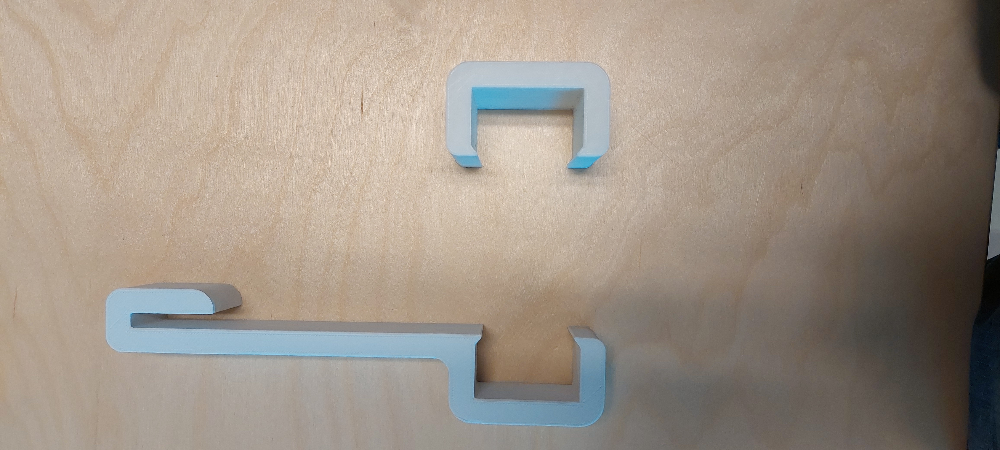
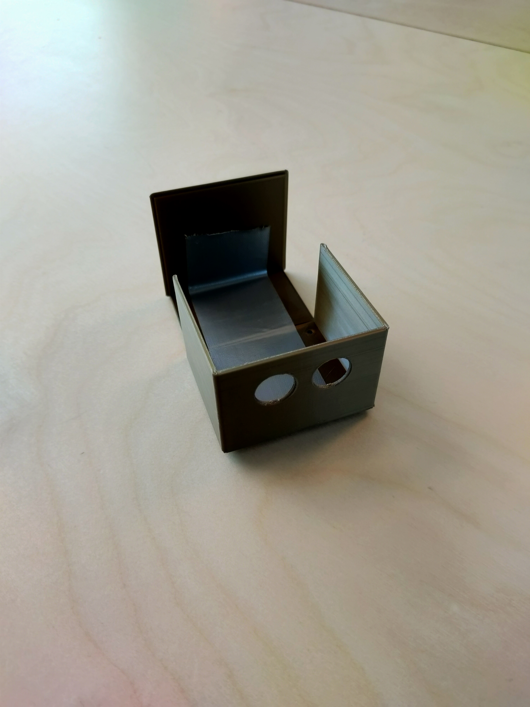
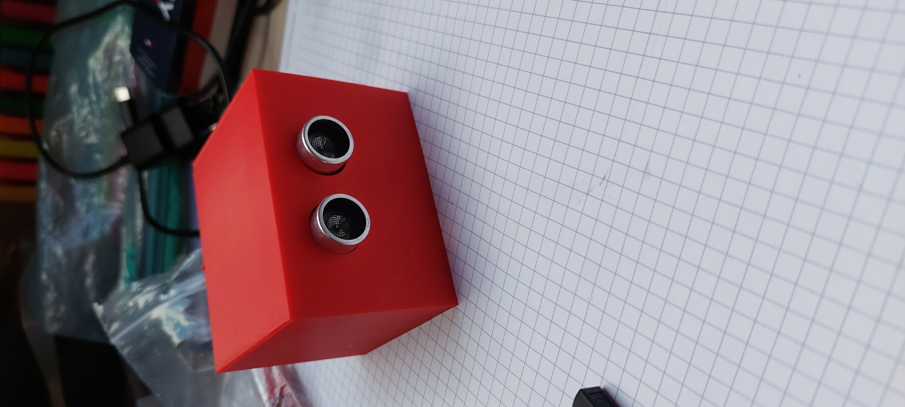
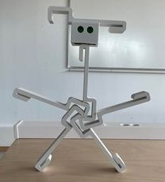

# Hardware

## Table of contents

- Ledstrip
- Sensor
- ESP32
- Kabelgoot
- 3D prints
- Voeding

## Ledstrip

TM1814 4IN1 5050 RGBW LED Strip Lights Multi Color Chasing, 60LEDs/m

## Sensor

Ultrasonic Distance Sensor HC-SR04 5V!

## ESP32

ESP32 Devkit V1 Board met WiFi Bluetooth en Dual Core processor

## Kabelgoot

Een plastieken kabelgoot van 2,3 cm hoog en 4,3 cm breed.

## 3D prints

3D prints voor de kapelgoot omhoog te houden en cases voor de sensors.

## Voeding

Meanwelll voeding 24 Volt

AC-DC Industrial DIN rail power supply; Output 24Vdc at 20A; Metal casing; Ultra slim width 85.5mm

