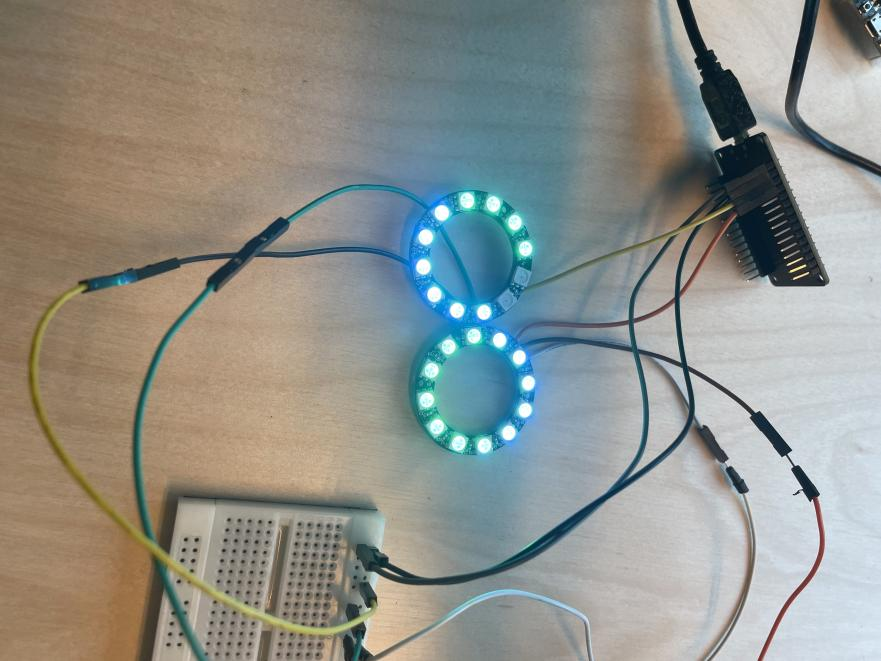
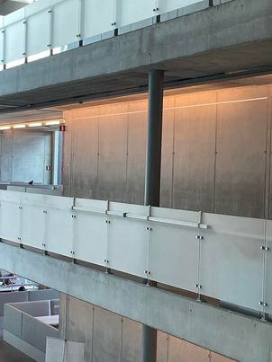

# Aurora
Uur inspiration for this project is the northern lights in Norway. This we want to recreate using ledstrips   
We Also will try to develop a person detection system with sensors

## Table of contents

- Short discription
- Required
  - Hardware
  - Software
- Installation
- Configuration
- Troubleshooting
- FAQ
- Maintainers
- project photos

## Short Discription

The project for the ARGB led strip and motion sensors.  
This is an interactive LED strip that tracks people and also can display random effects

## Required

These are the required software and hardware

 ### Software
 
 - Wled
 - Arduino
 - HTML
 - Python
 - Javascript
 - Docker
 
 ### Hardware

 - ESP32
 - WS2812B led strip
 - kabel goot 
 - 2,5 carre kabels
 - breadboard
 - Voeding
 - ultrasone sensor
 - 3d printed brackets
 - 3d printed joints

 > You can find extra information to buy the right components [here](./HARDWARE.md).

## Installation

> You can find all the information to install this project [here](./INSTALLATION.md).

## Configuration

No configuration yet

## Troubleshooting

No problems yet

## FAQ

no questions yet

## Maintainers
Made by  Glenn Coopman, Aitor Vannevel, thibaut schroyens, Thomas Oddery and Robbe Verhelst

## project Idea
a bridge over the minnewater in 2019  
 

## mood images

 

