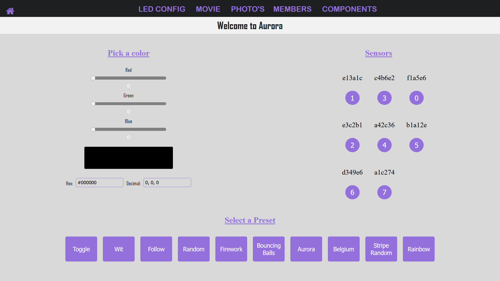
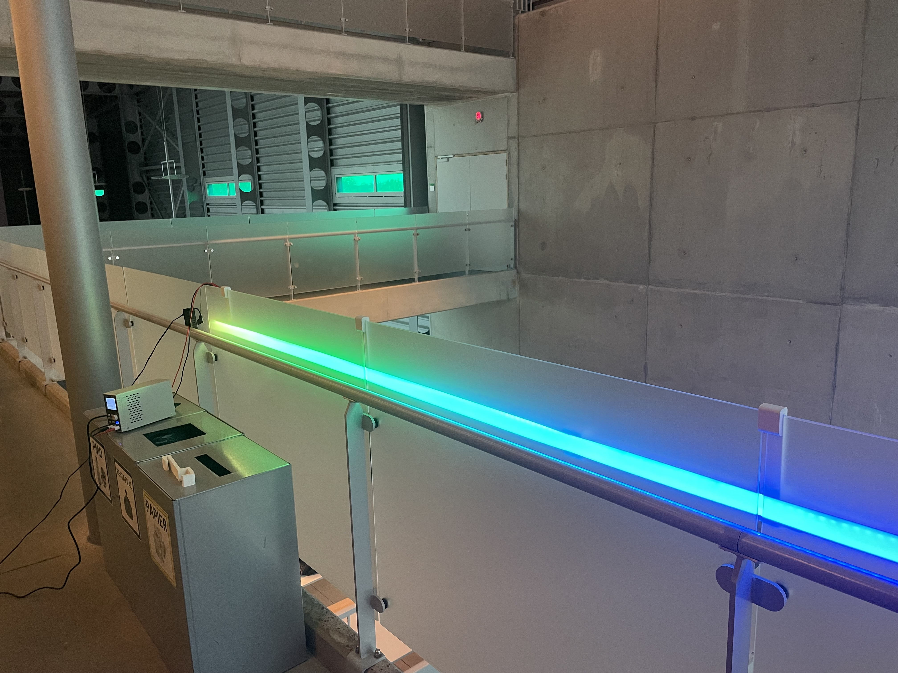

# Aurora

Our inspiration for this project is the northern lights in Norway. This is what we want to recreate using ledstrips  
We Also will try to develop a person detection system with sensors

## Table of contents

- [Short discription](#short-discription)
- [Required](#required)
  - [Hardware](#hardware)
  - [Software](#software)
- [Installation](#installation)
- [Configuration](#configuration)
- [Troubleshooting](#troubleshooting)
- [FAQ](#faq)
- [Maintainers](#maintainers)
- [project photos](#mood-images)

## Short Discription

The project for the ARGB led strip and motion sensors.  
This is an interactive LED strip that tracks people and also can display random effects

## Required

These are the required software and hardware

### Software

- Wled
- Arduino
- HTML
- Python
- Javascript
- Docker

### Hardware

- ESP32
- TM1814 led strip
- kabel goot
- 2,5 carre kabels
- breadboard
- Voeding
- ultrasone sensor
- 3d printed brackets
- 3d printed joints

> You can find extra information to buy the right components [here](./HARDWARE.md).

## Installation

> You can find all the information to install this project [here](./INSTALLATION.md).

## Configuration

- You can change the color of the ledstrip by dragging the sliders to the correct color.
- To change the order of the sensors, simply change the number under the sensor.
- You can select a preset by clicking on the desired button.

## Troubleshooting

Problems

1. Sensors cannot measure accurately at greater distances
2. Voltage drop on led strip
3. Communication between sensors
4. How to hold up led strip

## FAQ

- How can you add new sensors?
  > Just upload the program on your esp and connect to a WiFi network.
  > The ESP will automatically connect to the server.
-

## Maintainers

Made by Aitor Vannevel, Thibaut Schroyens, Thomas Oddery and Robbe Verhelst

## project Idea

A bridge over the minnewater in 2019  
 

## mood images

 

